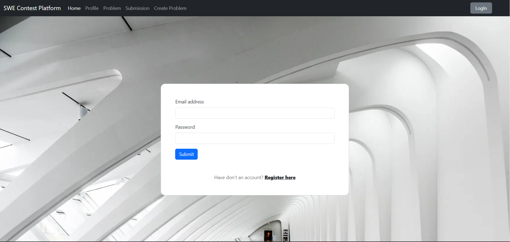
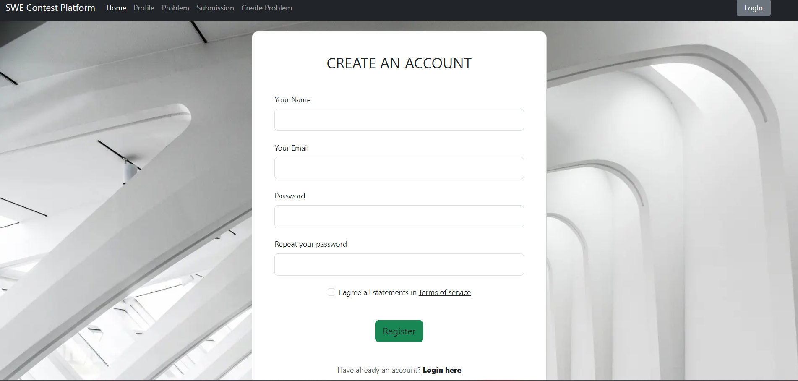
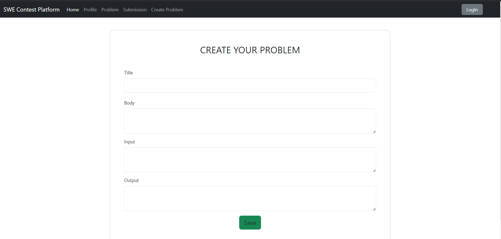
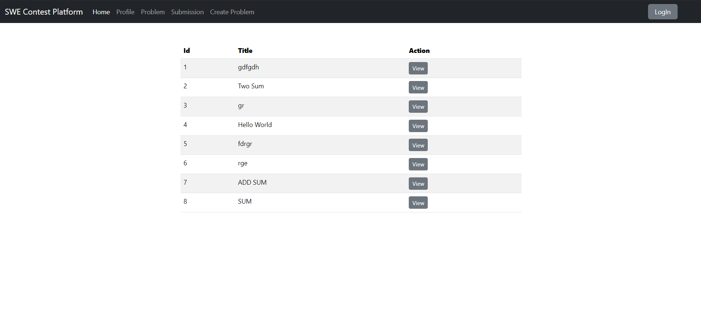

# Contest Platform & Online Judge

## Features
- [x] Authentication and Authorization
- [x] Submit your code
- [x] Test your code
- [ ] Results shows Time (Sec) and Memory (MB)
- [ ] Verdicts
    * Time Limit Exceeded (TLE)  
    * Memory Limit Exceeded (MLE)  
    * Compilation Error (CE)  
    * Runtime Error (RTE)  
    * Wrong Answer (WA)  
    * Accepted (AC)  
- [x] See your submissions
- [ ] Filter problems based on tags
- [ ] Search problems by name
- [ ] Dashboard for Statistics
- [x] Create Coding Problems
- [x] E-mail verification
- [x] Forgot password
- [ ] Leaderboard

## ViewSite

### SignIn

### SignUp

### Create Problem Page

### Problem List

### Problem Page

